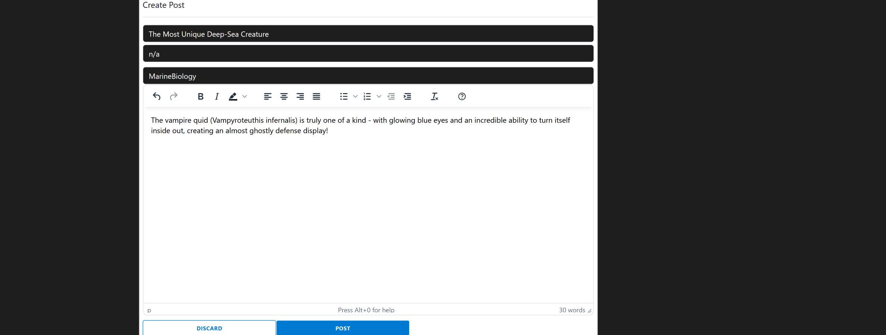

# PostIt - Reddit Clone

Full-stack web application mimicking core Reddit functionalities (user registration, post creation and upvoting/downvoting)

- Angular
- Bootstrap
- Spring Boot
- Spring Security
- JWT Authentication
- Swagger, Springdoc
- Mapstruct, Postman, Mailtrap
- MySQL

## Installation Requirements
- Java 22 or above

## Usage & Features
- Authentication and authorisation (signup/login)
- Create subreddits
- Create posts
- Comment on posts
- Vote on posts
- View posts
- View list of subreddits
- View user profile (all of a user's posts and comments)

## Screenshots

